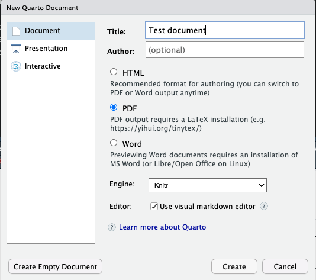

# Quintro

--- 6 hour introduction to Quarto ---

There are increasing demands on scientific staff in preparing reports
for governmental and public dissemination, as well as scientific
dissemination. Creating reports is a time-consuming task, as it often
requires switching between programs for writing, doing analyses and
creating tables and figures, as well as other graphical and textual
programs. Learning efficient tools in combining programming and report
generation are becoming increasingly important to alleviate the manual
and burdensome process of switching programs.Quarto is a second
generation report framework based on the popular markdown plain text
format. Combining writing in markdown with the ability to run code to
format, analyse, and visualise data, all in the same place, creates a
seamless environment for the researchers to produce reports.While this
workshop will focus on using Quarto with R, it also has native abilities
to interact with python, observable.js and Julia, without needing R
installed. This makes Quarto a great tool to learn, no matter which
language you focus on.

> **Aims**
>
> Understand the basics of markdown
>
> Ability to generate html & pdf reports, and presentations
>
> Ability to cross-reference report content and add citations
>
> Be able to use Academic Journal templates

# Schedule

-   Elements of a qmd ( \~ 45 minutes)

-   Making our first html report ( \~ 45 minutes)

-   Citations & cross-references ( \~ 45 minutes)

-   Lunch ( \~ 60 minutes)

-   Making our first pdf report (\~ 45 minutes)

-   Testing journal templates ( \~ 45 minutes)

-   Making our first presentation ( \~ 45 minutes)

# Preparations

This introductory workshop to Quarto is being instructed using R and
RStudio. It would be easiest for learners to follow along, and the
instructor to help you , if you also use this set-up.

Install instructions can be found on the [Quarto
webpages](https://quarto.org/docs/get-started/).

> **Install summary**
>
> -   install/update [Quarto CLI](https://quarto.org/docs/get-started/)
>
> <!-- -->
>
> -   install/update [R](https://cran.rstudio.com/)
>
> -   install/update
>     [RStudio](https://posit.co/download/rstudio-desktop/)

A new version of RStudio and R is recommended. Quarto is in rapid
development, please make sure your RStudio is the newest version
available (which will also install newest Quarto) to be able to follow
along the workshop. Even if you have R, RStudio and Quarto installed on
your system, you should update all three before the workshop.

> **Using another setup**
>
> You may choose to use vscode or another IDE, or even to do python in
> stead of R. However, know that the instructor will be less available
> to help using these tools, and code examples will need to be thought
> of by the learners them selves. Some examples on using other set-ups
> than R and RStudio can be found on the Quarto webpages.

## R packages

In addition to Quarto, a series of R packages will also be needed to
show-case the ways we can use Quarto to generate reports.

``` r
# Run in R
install.packages(c(
  "tidyverse",     # data-wrangling
  "knitr",         # table printing
  "kableExtra",    # pretty table printing
  "palmerpenguins" # dataset
))
```

## Tinytex

When creating PDFs from Quarto, we need to have LaTeX installed for that
conversion to happen. To install tinytex, open your RStudio and look for
a tab called `Console` (by default it should be in the lower left
corner). Next to the console, there should be a tab called Terminal, and
run the following command:

``` bash
quarto install tinytex
```

If the terminal is not visible next to the console, you need to enable
it. Go to `Tools -> Terminal -> Move focus to Terminal` and it should
pop up.

## Check the install

The best way to confirm that everything is installed correctly, is to
create a test quarto document. In RStudio, go to
`File -> New file -> Quarto document`

  
  
  
Fill in the title, and choose to create a PDF document (this will also
verify tinytex installation is successful).  
Click on `Create`.  
  
RStudio should open a document for you, which is the test document you
will render.  
Don’t think about the content just now, but find the `Render` button at
the top of the document.  
Click it and you should see some action in a new tab called “Background
jobs”.  
It will call on latex and maybe install some latex packages to create
your document.  
If it is successful, the RStudio Viewer window should come into focus
and you will see a preview of a PDF document with the title “Test
document”.  
This means everything went fine and you are ready!


## Troubleshooting

If you have problems getting things installed, please contact me, and I
will try help you get sorted.
